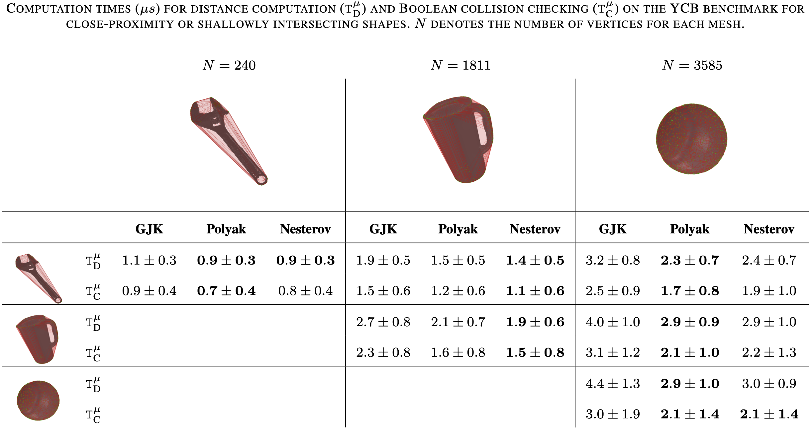

# Colbench

  

## Requirements
- cmake
- numpy
- pandas
- eigenpy==2.7.14
- proxsuite
- hppfcl (see below)

For trajectory generation:
- Pinocchio-3x
- contact-bench

## Installation
- Clone this repo
- Run `git submodule update --init`
- Install `hppfcl` submodule
  - `cd hppfcl`
  - `mkdir build && cd build`
  - `cmake -DHPP_FCL_HAS_QHULL=ON ..`
  - `make install`
- Install colbench
  - `mkdir build && cd build`
  - `cmake ..`
  - `make install`

## Run benchmarks
### Ellipsoids
- `./scripts/generate_ellipsoids_dataset.sh`
- `./scripts/run_ellipsoids_benchmark.sh`

### YCB
#### Standard YCB benchmark
First download ycb and post_process the dataset:
- `./scripts/download_and_process_ycb_dataset.sh`

To generate, run the benchmark and see the results:
- `./scripts/generate_ycb_dataset.sh`
- `./scripts/run_ycb_benchmark.sh`
